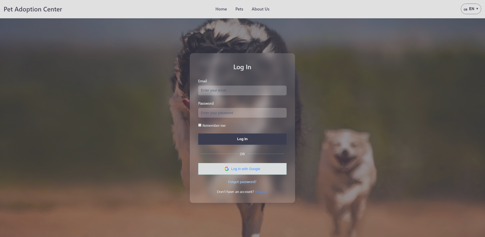
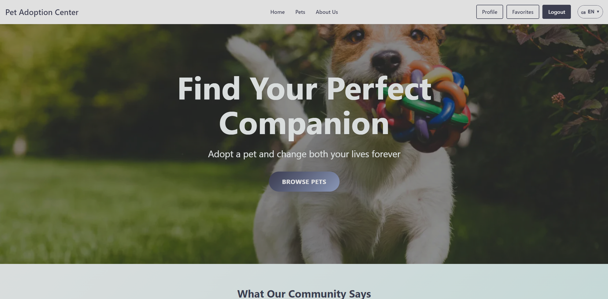
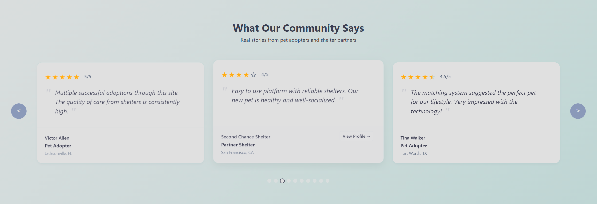
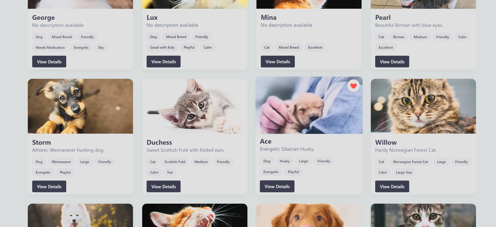
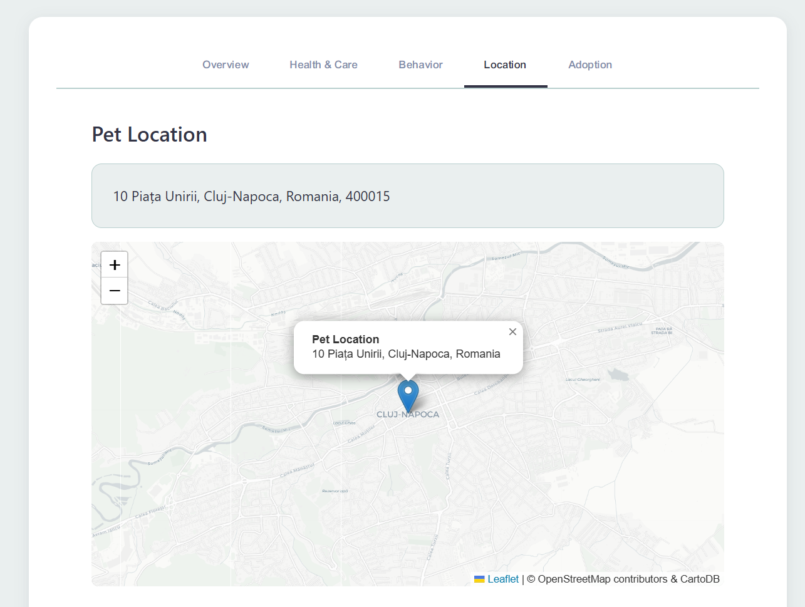
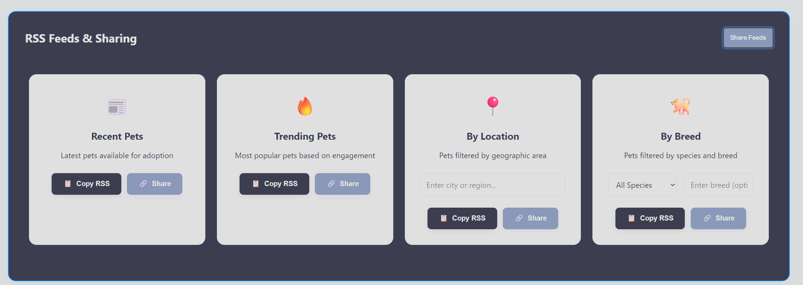

# PoW: Pet Adoption on Web
---

## 🐾 Project Description

**PoW** is a web platform that connects families and individuals to adopt or offer pets for adoption. Authenticated users can manage detailed pet profiles—including images, medical history, care schedules, and pickup locations—while tracking resources and sharing updates. The app features advanced filtering, social interaction, and an RSS feed for the latest adoption offers, making the adoption process simple, transparent, and community-driven.

---

## 📸 Screenshots

<p align="center">
  <b>Login Page</b><br>
  <br><br>
  <b>Home Page</b><br>
  <br><br>
  <b>Testimonials / Reviews</b><br>
  <br><br>
  <b>Pets Listing</b><br>
  <br><br>
  <b>Map in Pets Page</b><br>
  <br><br>
  <b>RSS Feed Example</b><br>
  
</p>

---

## 🛠️ Technologies Used

- **JavaScript** (frontend & backend logic)
- **HTML5** (structure)
- **CSS3** (styling)
- **Leaflet** + **OpenStreetMap** (maps integration)
- **JWT** (JSON Web Token for authentication)
- **OAuth 2.0** (Google OAuth login)
- **RSS Feed** (Syndication via RSS)
- **Database:** OracleXE

---

## 🌟 Highlighted Features

### 🐾 Pet Management & Adoption
- **Add/Edit Pet Profiles:** Users can add new pets with detailed info, images, medical history, care resources, and care schedules.
- **Rich Pet Profiles:** Each pet can have multiple images/videos, tags, medical history, and care instructions.
- **Pet Details Page:** View all details, images, and care info for each pet.

### 📸 Client-side Image Processing
- **Image Validation & Preview:** Images are validated for size and dimensions before upload, and previews are shown instantly.
- **Profile Image Selection:** Users can select which image is the pet’s profile picture.
- **Drag-and-drop & Multi-file Upload:** Supports uploading multiple images/videos at once.

### 🏷️ Custom Tags
- **Tag System:** Pets can be tagged with predefined or custom tags (e.g., “Friendly”, “Good with Kids”, “Special Needs”).
- **Add Custom Tags:** Users can create their own tags for pets.

### 🏥 Medical & Care Tracking
- **Medical History:** Add and display medical events for each pet.
- **Care Resources:** Track care instructions/resources for each pet.
- **Care Schedule:** Add scheduled activities (feeding, walks, etc.) for each pet.

### 🌍 Location Features
- **Map Integration:** Uses Leaflet and OpenStreetMap for setting and displaying pet locations.
- **Geocoding & Reverse Geocoding:** Converts addresses to map locations and vice versa.

### 🔒 Authentication & Authorization
- **JWT Auth:** Secure login and protected routes, with JWT-based session management.
- **Google OAuth:** Login with Google support for simplified authentication.
- **Role-based Access:** Admin/user roles with different permissions.

### 📧 Email Integration
- **Email Notifications:** Configurable email server for notifications (e.g., adoption status updates).

### 🏠 User Profiles
- **Profile Editing:** Users can edit their own profiles, including images and contact info.
- **Favorites:** Users can favorite pets for quick access.

### 📝 Admin Features
- **Admin Dashboard:** View and export database tables in CSV, JSON, XML, or TXT formats.
- **Table Schema & Data Export:** Admins can view table schemas and export data.

### 🌐 Internationalization
- **Language Dropdown:** Users can switch site language; language preference is persisted in localStorage.

### 📱 Responsive Design
- **Mobile Menu:** Adaptive navigation for mobile devices.
- **Floating Notifications:** User feedback for actions (success, error, info).

### 📰 RSS Feed
- **RSS Feed Generation:** Exposes pet data as an RSS feed for syndication and news aggregators.

---

## 🚀 Installation & Setup

1. **Clone the Repository**
   ```bash
   git clone https://github.com/picalexs/TW_2025.git
   cd TW_2025
   ```

2. **Install Dependencies**
   ```bash
   npm install
   ```
3. **Set Up the Database**

   - **Download and install Oracle XE 21c:**  
     [Download link & instructions](https://www.oracle.com/database/technologies/xe-downloads.html)
   
   - **Create a new user:**  
     Connect to your Oracle instance and run:
     ```sql
     CREATE USER pot_user IDENTIFIED BY "<your-password>";
     GRANT CONNECT, RESOURCE TO pot_user;
     ALTER USER pot_user QUOTA UNLIMITED ON USERS;
     ```
   
   - **Create tables and populate the database:**  
     Run the following scripts in order (located in the repository):
     1. `databaseScheme.sql` &mdash; creates the tables
     2. `triggers.sql` &mdash; sets up database triggers
     3. `populatingDB.sql` &mdash; populates the tables with sample data

     You can use SQL*Plus, SQLcl, or any Oracle database tool:
     ```bash
     sqlplus pot_user/<your-password>@localhost:1521/XEPDB1 @databaseScheme.sql
     sqlplus pot_user/<your-password>@localhost:1521/XEPDB1 @triggers.sql
     sqlplus pot_user/<your-password>@localhost:1521/XEPDB1 @populatingDB.sql
     ```

4. **Configure Environment**
   - Copy  to `.env` and add your configuration

  ```env
   # Database configuration
   DB_USER=
   DB_PASSWORD=
   DB_CONNECTION_STRING=
   DB_PORT=

   # API Server configuration
   BASE_URL=
   API_PORT=
   JWT_SECRET=
   TOKEN_EXPIRATION=

   # Email configuration
   EMAIL_HOST=           
   EMAIL_PORT=                      
   EMAIL_SECURE=                   
   EMAIL_USER=    
   EMAIL_PASS=

   # Google OAuth configuration
   GOOGLE_CLIENT_ID=
   GOOGLE_CLIENT_SECRET=
   GOOGLE_REDIRECT_URI=
   ```

5. **Run the Application**
   ```bash
   npm start
   ```
   The backend should now be running at `http://localhost:3000/` (or the specified port).
   For the frontend use a live server.

---

## 📝 License

_This project is licensed under the MIT License. See the [LICENSE](LICENSE) file for details._

---

## 👨‍💻 Authors
- [picalexs](https://github.com/picalexs)
- [bostangeorgiana](https://github.com/bostangeorgiana)

---
